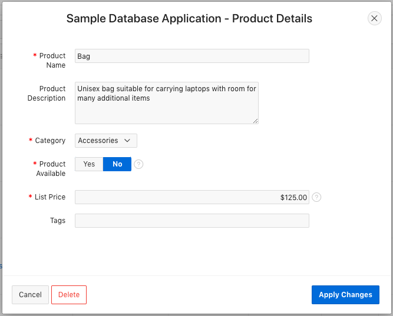

# 모듈 1 : APEX 애플리케이션에서 Javascript 사용

이 실습에서는 APEX 애플리케이션에 Javascript를 추가하는 가장 일반적인 방법을 배우게 됩니다.

### 파트 1 - Dynamic Actions
Dynamic Actions 는 APEX 애플리케이션에서 Javascript를 추가하는 가장 간단한 방법입니다. 이 단계에서는 항목의 값에 따라 페이지 구성요소를 숨기거나 보여주는 Dynamic Action 을 생성할 것입니다.

1. APEX Workspace에 로그인합니다.

   

2. 상단 메뉴의 **App Gallery** 로 이동한 뒤 **Sample Database Application** 을 클릭합니다.

   

3. **Sample Database Application** 실행 후 **Pruducts** 페이지로 이동 후 특정 상품의 **Name** 항목(예. Bag)을 클릭합니다. 그러면 아래와 같은 화면이 나타납니다.

   

   현재는 **Product Image** 와 그 이미지를 보여주는 영역은 **Product Available** 값이 **No**로 되어있어도 나타납니다. 이제 이어질 단계에서 Dynamic Action 을 사용해 **Product Available** 값이 **No**인 경우, 이미지 항목과 영역을 숨겨보도록 하겠습니다.

4. 이 샘플 애플리케이션의 Page Designer 로 이동한 후  Page 6 (Product Details) 로 이동합니다. 왼쪽의 Rendering 창에서 **P6_PRODUCT_AVAIL** 이름의 items 에서 마우스 오른쪽 클릭 후 **Create Dynamic Action** 를 선택합니다.

   

5. 오른쪽에 있는 properties 창에서 Name을 **P6_PRODUCT_AVAIL changed**로 변경합니다.  Event, Selection Type, Item(s) 값이 올바른지 확인합니다.

   

6. true, false 값에 따른 액션을 생성하기 위해 Client-side Condition 정의가 필요합니다. **Client-side Condition** 섹션에서 **Type**의 값을 **Item = Value**, **Item**의 값을 **P6_PRODUCT_AVAIL** 그리고 **Value** 값을 **Y**로 선택합니다.

   

7. 왼쪽창에서 **P6_PRODUCT_AVAIL changed** 의 Show 를 선택합니다. 이것은 Dynamic Actions 생성시 기본적으로 생성되는 액션입니다.

   

8. 오른쪽 창의 **Selection Type**을 **Item(s)**으로 선택하고 **Item(s)**를 **P6_PRODUCT_IMAGE**로 선택합니다.

   

   이렇게 하면 이미지 항목은 올바르게 표시됩니다. 그러나 그 영역에 대한 처리도 고려해야 합니다.

9. 왼쪽창의 **P6_PRODUCT_AVAIL_changed** 의 **Show** 액션에서 마우스 오른쪽 클릭 후 **Duplicate** 를 선택합니다.

   

10. 추가된 액션의 속성창(화면 우측)에서 **Select Type** 을 **Region** 그리고 **Region** 을 **..Product Image** 로 선택합니다.

    

11. 이제 Show 액션이 올바르게 구성되었지만 계속해서 Hide 액션을 생성해야 합니다. Hide는 Show의 반대이기 때문에 APEX에서는 이것을 쉽게 만들 수 있습니다. 왼쪽창에서 두 Show 액션모두 선택한 뒤 마우스 오른쪽을 클릭해서 **Create Opposite Action** 을 선택합니다.

    

    Dynamic Actions 의 False 항목아래 새로운 두개의 Hide 액션이 생성된 것을 볼 수 있습니다. 이렇게 생성했을 때 좋은점은 이전 액션의 설정이 이미 구성되어 있는 부분입니다.

12. 변경사항을 저장한 후 해당 APEX 애플리케이션으로 돌아갑니다. Product 항목 상세 페이지 팝업을 닫고 Name 항목을 클릭해 다시 엽니다. 이제 이미지 항목과 영역은 **Product Available**의 값에 따라 보여지거나 숨겨집니다. Dynamic Actions를 사용해 이런것을 생성할 수 있었습니다.

    

### 파트 2 - Javascript 를 사용한 Dynamic Actions

Dynamic Actions 은 다양한 Javascript hook 또는 Javascript를 조금 아는 개발자에게 맞는 기능을 제공합니다. 이러한 기능을 통해 더 강력하고 유연한 개발툴이 될 수 있습니다.

이 단계에서는 이전 단계에서 만든 Dynamic Actions에 Javascript를 사용해보겠습니다. 최종 결과는 동일하지만 Javascript hook 사용에 대한 이해를 통해 필요한 상황에서 유용하게 사용할 수 있습니다.

1. 이 애플리케이션의 Page Designer 에서 page 6 로 이동한 뒤 이전 파트에서 생성한 Dynamic Action 을 선택합니다.

   

2.  오른쪽 창의 When 섹션에서 **Event** 는 **Custom** 선택, Custom Event 에 **change** 를 입력, **Selection Type** 은 **jQuery Selector** 선택 그리고 **jQuery Selector** 에는 **#P6_PRODUCT_AVAIL** 를 입력합니다.

   

3.  **Client-side Condition** 섹션에서 **Type** 을 **JavaScript expression** 을 선택하고 **JavaScript Expression** 에 다음 코드를 입력합니다.

    `code: $v(this.triggeringElement.id) === 'Y'`

   

   $v 는 **[JavaScript APIs for APEX](https://docs.oracle.com/en/database/oracle/application-express/20.2/aexjs/index.html)** 에서 제공하는 function 입니다. 특정 항목의 값을 리턴합니다. 항목의 ID속성은 동적으로 획득되어 이름이 변경되는 경우 표현식을 변경할 필요가 없습니다.

4.  해당 액션을 수정하기 전에 Product Image 영역에 일관된 ID를 설정할 수 있도록 영역 프로퍼티값을 셋팅합니다. 왼쪽창에서 **Product Image** 영역을 선택합니다.

   

5.  오른쪽 창에서 **Static ID** 에 **product-image-reg** 를 입력합니다.

   

6. 왼쪽 창에서 **Dynamic Action** 탭을 선택합니다. 이 작업은 더이상 Dynamic Action 해당 항목에 직접 연결되지 않기 때문에 필요한 작업입니다.

   두개의 **Show** 액션중 하나에서 마우스 오른쪽 버튼을 눌러 **Delete** 를 클릭합니다. 다음으로 남아있는 **Show** 액션을 선택합니다.

   

7. 오른쪽 창의 Action 을 **Execute JavaScript** 로 선택하고 다음의 코드를 **Code** 영역에 입력합니다.

   ```javascript
   $('#product-image-reg').show();
   $('#P6_PRODUCT_IMAGE')
   .closest('.t-Form-fieldContainer')
   .show();
   ```

   이 코드는 다음 실습에서 설명될 DOM 을 통한 조작 방법을 사용합니다. 입력한 상태는 다음과 같습니다.

   

8. **Fire on Initialization** 속성을 **On** 으로 설정

   

9. 왼쪽창에서 **Dynamic Action** 탭을 선택합니다. Hide 액션중 하나에서 오른쪽 버튼 클릭 후 **Delete** 를 클릭합니다. 그런다음 남아있는 **Hide** 액션을 선택합니다.

   

10. 오른쪽창에서 Action 을 Excute JavaScript 를 선택하고 아래 코드를 Code 속성의 값으로 입력합니다.

    ```javascript
    $('#product-image-reg').hide();
    $('#P6_PRODUCT_IMAGE')
    .closest('.t-Form-fieldContainer')
    .hide();
    ```

    액션 속성값은 다음과 같아야 합니다.

    

11. **Fire on Initialization** 속성을 **On** 으로 설정

    

12. 이제 변경사항을 저장하고 해당 페이지를 다시 오픈합니다. 이전과  동일하게 동작합니다. APEX에서 만들어져 제공되는 방식이 Javascript 보다 훨씬 간단하다고 보여집니다. 하지만, 다양한 유연성이 필요한 경우 이 방식을 사용할 수 있습니다.

### 파트 3 - Page 및 컴포넌트 level의 속성 사용

Dynamic Actions 이외에도 Javascript를 위해 만들어진 다양한 속성과 컴포넌트가 있습니다. 이번 파트에서는 이러한 속성들이 어디에 있는지 그 사용 방법에 대해 알아보겠습니다.

1. Page Designer 에서 메인페이지인 page 1 을 선택합니다. 그리고 왼쪽 랜더링 탭의 트리에서 root element 를 선택합니다.

   

2.  오른쪽 속성창에서 아래로 스크롤을 내리면 **Javascript** 섹션을 찾을 수 있습니다. **Function and Global Variable Declaration** 속성에 아래 function 를 추가합니다.

   ```javascript
   function doWork() {
     console.log('doWork fired!');
   }
   ```

   해당 속성의 코드는 DOM 로드 이벤트와 APEX 컴포넌트 초기화 되기 이전의 글로벌 범위에서 실행됩니다.

   그런 다음 아래 코드를 **Execute when Page Loads** 속성에 추가합니다.

   ```javascript
   doWork();
   ```

   해당 속성의 코드는 DOM 로드 이벤트와 APEX 컴포넌트 초기화되면 function 범위에서 실행됩니다.

   설정은 다음과 같습니다.

   

3.  변경사항을 저장한 뒤 사용하는 브라우저의 **개발자도구 > console** 을 오픈한 뒤 해당 APEX 어플리케이션의 홈페이지로 이동합니다. `doWork` function 이 실행되었음을 볼 수 있습니다.

   

4.  Report > Sales by Category 메뉴로 이동합니다. 현재 보여지는 차트의 각 카테고리에 매핑된 색상은 랜덤선택 된 색상입니다. 이제 여기에 Javascript 코드를 추가해 지정된 색상으로 변경해보겠습니다.

   

5. 해당 애플리케이션의 Page Designer 에서 page 16으로 이동한 뒤 왼쪽창에서 Content Body 아래의 **Sales by Category** 를 선택합니다. 그리고 오른쪽 창의 **Attribute** 탭으로 이동한 뒤 **JavaScript Initialization Code** 필드에 다음 function 을 입력합니다.

   

6. 이제 변경사항을 저장하고 해당 페이지로 돌아갑니다. 기존과 동일한 차드인데 색상이 초록색 계통 색상으로 변경된 것을 확인할 수 있습니다.

   

### 파트 4 - Static Files 사용하기

이전 파트에서는 Javascript 코드를 각 페이지에 직접 추가했습니다. 하지만 때로는 성능이나 재사용성의 이슈로, Javascript 파일을 Static Files로 사용하는것이 필요할 수 도 있습니다. 그래서 이번 파트에서는 이전에 추가한 코드를 Static Files로 이동하여 수행하는 실습을 해보겠습니다.

1. 다음에 나오는 코드 이전 파트에서 홈페이지에서 실행한 `doWork` function 그리고 Sales by Category 화면에서 사용한 차트 색상 변경 function 입니다. 변경 된 부분은 차트색상을 변경하는 function이 이전에는 익명 function 이었는데 지금은 이름이 있습니다.

   다음 코드를 파일명 **sample-db-app.js** 으로 저장해주세요.

   ```javascript
   function doWork() {
     console.log('doWork fired!');
   }
   
   function styleSalesByCatChart(options) {
     options.dataFilter = function(data) {
       data.series[0].color = '#0B6623';
       data.series[1].color = '#9DC183';
       data.series[2].color = '#708238';return data;
     };
   
     return options;
   }
   ```

2. 해당 APEX 애플리케이션의 **Shared Components > Static Application Files** 로 이동합니다. **Upload File** 버튼을 클릭한 뒤 **File(s)** 영역에는 이전 단계에성 생성한 **sample-db-app.js** 파일을 추가하고 **Upload** 버튼을 클릭합니다. 새롭게 업로드한 파일의 **Reference** 컬럼값 **\#APP_IMAGES#sample-db-app.js** 를 노트해주세요. 이 값은 다음 단계에서 사용될 예정입니다.

   

3. 페이지 디자이너에서 page 16 으로 이동합니다. 왼쪽창에서 **Sales by Category** 선택 후 오른쪽 창의 **Attributes** 탭으로 이동한 뒤 아래로 스크롤을 내려보면 **JavaScript Initialization Code** 항목이 있습니다. 여기에 Reference 값을 입력합니다. `JavaScript Initialization Code`

   

   function 명 끝에는 괄호가 없습니다. 이것은 function  호출이 아니라 파일에 선언된 함수에 대한 참조값을 의미합니다. APEX 는 적절한 시기에 이 함수를 실행합니다.

4. 왼쪽창의 랜더링 탭에서 root node 를 선택한 뒤 아래의 파일 레퍼런스 값을 JavaScript 섹션의 File URLs 항목 값으로 입력합니다.

   

5. 이제 변경사항을 저장한 뒤 해당 페이지를 실행합니다. 해당 차트의 색상이 이전과 동일한 색상으로 표시되는 것을 확인할 수 있습니다. 이는 Static Files 가 정상적으로 적용되었고 이제 이 파일은 다른 곳에서도 사용할 수 있습니다.

6. 해당 애플리케이션의 Page Designer에서 page 1로 이동 후 root node 를 선택합니다. 오른쪽창의 JavaScript 섹션에서 **Function and Global Variable Declaration** 항목 값을 삭제하고 이번에 추가한 file reference 를 **File URLs** 항목에 추가합니다.  **`#APP_IMAGES#sample-db-app.js`** 

   

7. 변경사항 저장 후 해당 애플리케이션을 실행하면 이전과 동일하게 `doWork` function 이 수행되어 출력한 메시지를 확인할 수 있습니다.


모듈 1 실습이 끝났습니다. 이번 실습에서는 APEX에서 Javascript를 사용하는 방법을 이해할 수 있었습니다. 다음은 [모듈 2](./Module1.md) 실습으로 이동합니다.

