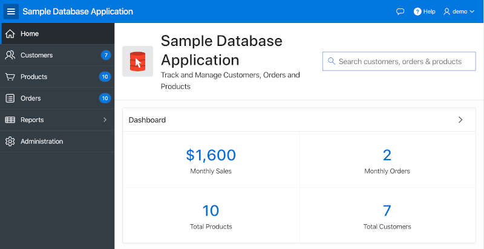

# 모듈 2 : APEX 애플리케이션에서 jQuery 테스트

### 파트 1 - jQuery 를 이용한 선택, 속성변경 테스트

jQuery를 사용하면 쉽게 elements를 선택하고, DOM 트리를 이동하고, 필요에 따라 DOM을 변경할 수 있습니다. 이번 단계에서는 몇 가지 jQuery 사용한 테스트를 해보겠습니다.

1. APEX Workspace 에 로그인한 뒤 **App Builder > Sample Database Application** (이전 모듈에서 설치한)으로 이동합니다. 그런 다음 해당 APEX 애플리케이션을 실행 한 뒤 메인페이지를 살펴보겠습니다.

   

2. 사용중인 브라우저의 개발자도구를 오픈합니다. (Chrome의 경우 F12) 그리고 오르쪽 상단의 Search Bar 의 elements를 찾아봅니다.

   

   개발자도구에서 볼 수 있듯이 APEX의 Name이 페이지가 랜더링 될 때 ID로 지정됩니다. 그리고 multiple elements (예. checkbox, radio group, shuttles, etc.)를 사용한 경우 Name 은 상위 DOM에 매핑됩니다. 

   이제 다음의 코드를 console 에 입력을 하여 서치바를 사용불가능한 상태로 변경해보겠습니다.

   ```javascript
   $('#P1_SEARCH').attr('disabled', 'disabled');
   ```

   이제 다시 해당 항목을 원래 상태로 되돌리겠습니다. 다음 코드를 실행합니다.

   ```javascript
   $('#P1_SEARCH').removeAttr('disabled');
   ```

3. 사용중인 브라우저의 개발자도구에서 Dashboard 영역의 ID를 찾아봅니다.

   

   해당 영역의 ID는 랜덤으로 생성됩니다. **R2177368582615194411** 와 같은 형태인 것을 확인할 수 있습니다. 이러한 ID들은 보통 배포시마다 변경되므로 운영환경 배포시에도 변경되며, 따라서 Javascript 코드에 해당 ID를 사용하면 안됩니다.

   Page Designer 에서 이 애플리케이션의 홈 페이지인 page 1 로 이동한 뒤 왼쪽에 위치한 랜더링 창에서 Dashboard 영역 선택합니다. 그리고 오른에 있는 속성창에서 Advanced 섹션의 **Static ID** 를 **dashgoard-reg** 로 변경합니다.

   다시 해당 화면으로 돌아와서 대시보드 영역의 ID를 확인하면 새로 입력한 Static ID로 되어있는것을 확인할 수 있습니다. 이제 해당영역을 사라지게 하고 다시 나타나게 하는 다음 코드를 실행해보겠습니다.

   ```javascript
   $('#dashboard-reg').hide();
   ```

   다음은 대시보드 영역을 다시 원래 상태로 변경하는 코드 입니다.

   ```javascript
   $('#dashboard-reg').show();
   ```

   `hide` 와 `show` 대신  각각 `fadeOut` 와 `fadeIn` 를 사용할 수 도 있습니다.

4. 개발자 도구를 사용해서 APEX 애플리케이션 오른쪽 상단에 있는 네이게이션 바를 검사해봅니다.

   

   해당 네비게이션바는 `ul` element 와 여러개의 `li` elements 로 이루어져 있는것을 볼 수 있습니다..

   `ul` 의 두번째 `li` 에 특정 class를 추가하는 다음 코드를 실행해보세요.

   ```javascript
   $('.t-NavigationBar').children().eq(1).addClass('icon-only');
   ```

   그런 다음, 해당 리스트를 다시 원래 상태로 변경하는 다음 코드를 실행해보세요.

   ```javascript
   $('.t-NavigationBar').children().eq(1).removeClass('icon-only');
   ```

   

### 파트 2 - jQuery 를 이용한 event 테스트

이번 파트에서는 기본적인 이벤트 리스너를 생성한 다음 APEX에서 가끔 이벤트 위임이 필요한 이유를 알아보겠습니다.

1.  Sample Database Application 의 Products 페이지로 이동합니다. 그리고 다음에 주어진 코드를 실행해서 상품리스트 이미지에 클릭 이벤트 핸들러를 추가합니다.

   ```javascript
   $('img').on('click', function() {
     console.log('You clicked an image!');
   });
   ```

   이 코드를 수행한 뒤 상품 이미지를 클릭해봅니다. 'You clicked an image!' 라는 메시지가 콘솔에 출력되는 것을 확인할 수 있습니다.

   그런 다음 상품리스트 상단 서치바의 `Go`버튼을 클릭하고 다시 상품리스트의 이미지를 클릭해봅니다. 해당 row가 이벤트가 바인딩 되지 않는 새 elements 로 대체되었기 때문에 더 이상 콘솔에 메시지가 나타나지 않습니다. 다음 단계에서는 이벤트 위임을 통해 이런 문제를 해결해 보겠습니다.

2. 다음 코드를 실행해서 상품리스트에 이벤트 핸들러를 추가해봅니다. 이 이벤트 핸들러는 DOM 트리상 훨씬 더 아래에 있는 이미지에서 클릭 이벤트를 수신합니다.

   ```javascript
   $('#productsIRR').on('click', 'img', function() {
     console.log('You clicked an image!');
   });
   ```

   이 코드를 수행한 뒤 상품리스트의 이미지를 클릭하면 당연히 정상적으로 클릭 이벤트가 수행됩니다. 그런 다음 다시 서치바의 `Go` 버튼을 클릭한 뒤 상품리스트의 이미지를 클릭해봅니다. 이번에는 계속해서 콘솔창에 메시지가 출력됩니다.

3. 이벤트 위임, DOM 조작을 사용하는 좀 더 자세한 예제를 보려면 다음 코드를 실행한 다음 상품리스트의 이미지를 클릭해보세요.

   ```javascript
   $('#productsIRR').on('click', 'img', function() {
     $img = $(this);
   
     // Walk the DOM to get the product name
     productName = $img.parent('td').next('td').children('a').text();
   
     // Change the breadcrumb to include the product name of the image clicked
     $('.t-Breadcrumb-label').text('You clicked the ' + productName);
   });
   ```

   이 예제가 DOM과 jQuery를 설명하는 최고의 예제는 아니지만, DOM과 jQuery의 활용이 얼마나 유용한지 알 수 있을것 같습니다.

이것으로 이번 실습을 완료했습니다. 이제 이벤트의 동작 방식과 APEX에서 이벤트 위임을 사용할 수 있는 방법을 배웠습니다.